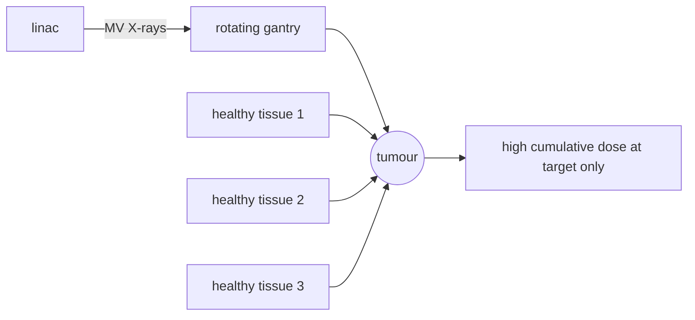

# Radiation Therapy

## Problem Context

Ionising radiation damages DNA. Rapidly dividing cancer cells are more sensitive to that damage than most healthy tissue, so a carefully targeted radiation dose can kill a tumour while letting surrounding tissue recover. The physics challenge is delivering enough dose to the tumour while keeping the dose to healthy tissue along the beam path below a safe limit.

## Physical Ideas

- [[X-ray-Attenuation]]
- [[Radioactivity]]
- [[Activity]]
- [[Half-Life]]
- [[Effective-Half-Life]]

## Mathematical Tools

- $I = I_0 e^{-\mu x}$ for beam attenuation through tissue
- $A = \lambda N$ for sealed-source activity
- inverse-square fall-off for point sources

## External Beam Therapy

A linear accelerator ("linac") produces high-energy X-rays — typically 4–20 MV photon beams, much harder than the $\sim 100$ kV beams used for diagnostic [[X-ray-Imaging]]. Higher energy means smaller $\mu$, so the beam penetrates deeply and deposits a larger fraction of its dose at depth rather than at the skin.

To spare healthy cells along the beam path, several techniques are combined:

1. **Multiple beams from different angles** focused on the tumour. Each beam passes through different healthy tissue but they all converge at the target, so the tumour receives the sum of doses while each surrounding region receives only one beam's worth.
2. **Beam rotation** (arc therapy) — the gantry rotates continuously around the patient so no single column of healthy tissue is in the beam for long.
3. **Shaped beams** (collimators / multi-leaf collimators) match the beam outline to the tumour shape projected from each angle.
4. **Fractionation** — splitting the total dose into many small daily fractions (typically 2 Gy/day over several weeks). Healthy tissue repairs sub-lethal damage between fractions more effectively than tumour tissue, widening the therapeutic margin.

## Internal Therapy (Brachytherapy)

Small sealed radioactive sources are implanted in or next to the tumour. Because dose falls off rapidly with distance (inverse-square plus tissue attenuation), the tumour receives a very high local dose while tissue a few centimetres away is largely spared. Short-range beta emitters (or low-energy gamma emitters) are chosen so the dose is confined:

- iodine-125 seeds for prostate cancer
- iridium-192 wires for temporary implants
- strontium-90 plaques for eye tumours

Source choice balances physical half-life (long enough to deliver the prescribed dose, short enough that the implant becomes inert), photon/beta energy (range in tissue), and ease of handling.

## Typical Questions

- Why use MV X-rays for therapy but kV X-rays for imaging?
- Why fractionate the dose instead of giving it all at once?
- Why are beta emitters preferred over alpha emitters for brachytherapy seeds?
- Compare external beam and brachytherapy for a deep vs surface tumour.

## Method Outline

1. CT scan to map tumour position and surrounding critical structures
2. Treatment plan computed to maximise tumour dose and minimise organ-at-risk dose
3. Patient immobilised; daily fraction delivered with image guidance
4. Course completed over several weeks (external) or implant in place for the planned period (internal)

## Assumptions

- Tumour position is reproducible between sessions
- Healthy tissue recovers between fractions
- Source activity and decay are accurately known

## Comparison with Imaging Methods

For a deep tumour: external MV X-rays penetrate well but irradiate tissue along the beam; brachytherapy spares distant tissue but requires an invasive implant. For comparison, [[Ultrasound-Imaging]] uses no ionising radiation but is diagnostic, not therapeutic; [[PET-Scanning]] localises tumours before therapy planning; [[CT-Scanning]] provides the geometric and density map required for accurate dose calculation.

## Links to Other Subjects

- Biology: DNA damage and repair kinetics
- Mathematics: optimisation of beam weights in treatment planning

## Frontier Links

- [[Particle-Physics-Map]] — proton and heavy-ion therapy use the Bragg peak to deposit dose at a chosen depth, reducing exit dose

## Common Mistakes

- Confusing the kV X-rays used for diagnosis with the MV X-rays used for therapy
- Assuming a single high-dose treatment is safer than fractionation
- Treating brachytherapy as systemic — it is highly local
- Forgetting that effective half-life, not physical half-life, governs how long an implant remains active in the body

## Visuals

*Source: Authored for this vault (CC0). No external copyright.*

### From Wikimedia

<!-- wiki-images: yes -->

#### Medical linear accelerator
![[_attachments/10_Applications/Radiation-Therapy--wiki-linac.jpg]]
*Figure: a clinical linac — the rotating gantry directs MV X-ray beams from many angles onto a tumour while sparing surrounding tissue.*
*Source: Wikimedia Commons — [Clinac vnitrek.jpg](https://commons.wikimedia.org/wiki/File:Clinac_vnitrek.jpg) — CC BY-SA 2.5 — Egg. Retrieved 2026-06-27.*

## Source Trace

- Source: [[AQA-Physics-7407-7408-Specification]] §3.10.5–§3.10.6
- Public reference: HyperPhysics — Radiation therapy; OpenStax College Physics §32
