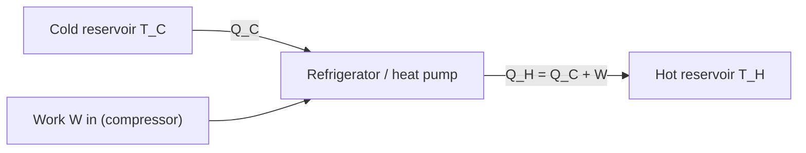

# Reversed Heat Engines

## Problem Context

Run a heat engine backwards and you get a **refrigerator** or a **heat pump**: a device that uses external work to move heat from a cold space to a hot space. This is the operating principle of fridges, freezers, air conditioners and domestic heat pumps. The [[Second-Law-of-Thermodynamics]] permits this — heat will flow "uphill" provided work is supplied — and sets a maximum on how much heat you can move per joule of work.

## Physical Ideas

- [[First-Law-of-Thermodynamics]] — energy balance for the device.
- [[Second-Law-of-Thermodynamics]] — Carnot ceiling on performance.
- [[Energy-Transfer]] — heat flowing between reservoirs and work flowing in.
- [[Thermodynamic-Processes]] — the reversed cycle on a pV diagram.

## Mathematical Tools

The first law for one cycle:

$$Q_H = Q_C + W$$

- $Q_C$ — heat removed from the cold space per cycle, J.
- $W$ — work done **on** the working fluid per cycle (by the compressor), J.
- $Q_H$ — heat dumped to the hot side per cycle, J.

### Coefficient of performance (COP)

Performance is not called efficiency, because COP is usually greater than 1 — you get **more heat moved** than the work supplied.

**Refrigerator** (what we want is heat removed from the cold space):

$$\text{COP}_{\text{ref}} = \frac{Q_C}{W}$$

Maximum (Carnot) value:

$$\text{COP}_{\text{ref, max}} = \frac{T_C}{T_H - T_C}$$

**Heat pump** (what we want is heat delivered to the hot space — your living room):

$$\text{COP}_{\text{hp}} = \frac{Q_H}{W}$$

Maximum (Carnot) value:

$$\text{COP}_{\text{hp, max}} = \frac{T_H}{T_H - T_C}$$

In both formulas $T_H$ and $T_C$ are absolute temperatures in **kelvin**. The two COPs are related by

$$\text{COP}_{\text{hp}} = \text{COP}_{\text{ref}} + 1$$

because every joule of work supplied also ends up as heat in the hot reservoir.

### Numerical feel

A heat pump moving heat from outside air at 273 K (0 °C) to a room at 293 K (20 °C):

$$\text{COP}_{\text{hp, max}} = \frac{293}{293 - 273} \approx 14.7$$

So in principle each joule of electrical work could deliver about 14.7 J of heat to the room — far more than direct electrical heating. Real heat pumps achieve COP ≈ 3–4 because of irreversibilities and refrigerant cycle losses.

## Typical Questions

- Calculate the work needed to remove a stated heat load from a fridge, given $T_H$, $T_C$.
- Compare a heat pump's COP to a direct electric heater on the same electrical input.
- Explain why fridges become less efficient on a hot day (rising $T_H$ widens the gap, lowering COP).
- Identify direction of heat and work flows on a block diagram.

## Method Outline

1. Identify the hot and cold reservoirs and convert temperatures to kelvin.
2. Choose the correct COP formula — fridge if you care about $Q_C$, heat pump if you care about $Q_H$.
3. Find Carnot maximum as a sanity ceiling.
4. Apply $Q_H = Q_C + W$ to fill in any unknown energy.
5. Convert per-cycle energies to powers using cycles per second if needed.

## Assumptions

- Steady-state cyclic operation.
- Reservoirs are large enough for $T_H$, $T_C$ to stay constant.
- Carnot ceilings assume reversible operation — real devices fall short.
- Working fluid (refrigerant) is treated as an ideal cyclic medium for A-Level purposes.

## Links to Other Subjects

- Engineering: refrigeration cycles (vapour-compression), refrigerant choice.
- Climate / sustainability: heat pumps as low-carbon home heating.

## Frontier Links

- Absorption refrigerators and other non-mechanical cycles.
- Magnetocaloric and thermoelectric refrigeration.

## Common Mistakes

- Calling COP "efficiency" and being puzzled when it exceeds 1.
- Forgetting kelvin and getting nonsense (or division by zero when $T_H = T_C$).
- Using $\text{COP}_{\text{ref}}$ when the question asks about a heat pump (or vice versa).
- Forgetting that $Q_H = Q_C + W$ — the work supplied ends up as heat in the hot reservoir.

## Visuals

### Refrigerator / heat-pump block diagram

*Figure: A reversed heat engine moves heat Q_C from the cold reservoir to the hot reservoir, using work W supplied by the compressor.*
*Source: Authored for this vault (CC0). No external copyright.*

## Source Trace

- Source: [[AQA-Physics-7407-7408-Specification]] §3.11.2 (Engineering Physics — Reversed heat engines)
- Public source: HyperPhysics (refrigerator, heat pump, COP); OpenStax College Physics §15.5.
- Section/Page: AQA specification §3.11.2.3
