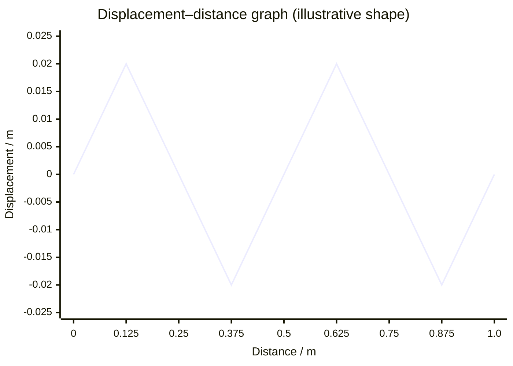

# Confusing Wavelength and Amplitude

## Mistake

Reading the height of a wave on a graph as its wavelength, or thinking a
"bigger" wave automatically has a longer wavelength.

## Why It Happens

On a displacement–distance graph both quantities are lengths shown on the
same picture, so students grab the wrong axis. Casual speech ("big waves")
also blurs the difference between tall and long.

## Example

A displacement–distance graph shows a wave with peaks 0.02 m above the axis,
repeating every 0.5 m. A student states the wavelength is 0.02 m. In fact
0.02 m is the [[Amplitude]] (maximum displacement from equilibrium, read on
the vertical axis) and 0.5 m is the [[Wavelength]] (distance for one full
cycle, read on the horizontal axis).

## Correct Approach

Identify the axes first. [[Amplitude]] is the vertical distance from the
middle to a crest. [[Wavelength]] is the horizontal distance between two
matching points (crest to crest). Amplitude links to energy carried; only
wavelength enters $v = f\lambda$.

## Foundation Link

It builds on distinguishing "how tall" from "how long" when reading a
repeating pattern.

## Related Quantities

- [[Wavelength]]
- [[Amplitude]]

## Related Concepts

- [[Standing-Waves]]

## Related Methods

- Reading amplitude and wavelength from labelled wave graphs

## Related Problem Types

- Wave-graph interpretation and $v = f\lambda$ calculations

## Visuals

### Displacement–Distance Wave: Amplitude vs Wavelength

*Figure: A displacement–distance graph. The vertical distance from the equilibrium line to a crest is the **amplitude** (0.02 m, read on the y-axis). The horizontal distance for one complete cycle (crest to next crest) is the **wavelength** (0.5 m, read on the x-axis). The two quantities occupy different axes and must not be swapped.*

*Source: Authored for this vault (CC0). No external copyright.*

## Source Trace

OpenStax College Physics; HyperPhysics; The Physics Classroom — no copied text.

OCR alignment: [[OCR-Physics-A-H556-Specification]]
