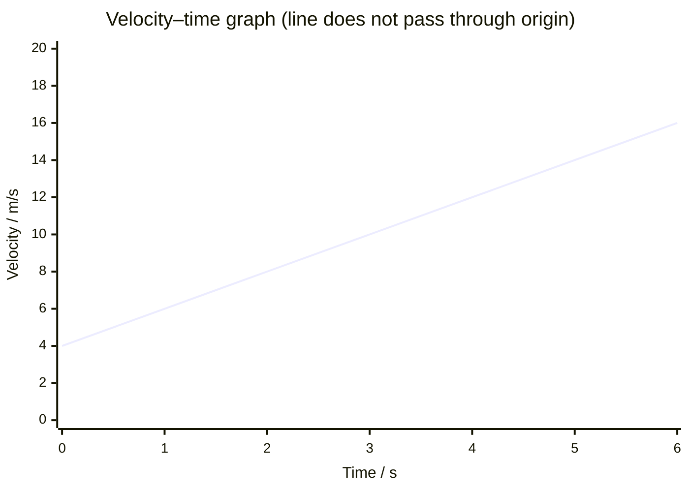

# Misreading Graph Gradient

## Mistake

Reading a gradient incorrectly — using a single point's coordinates instead of a change, ignoring axis scales or prefixes, or misidentifying what the gradient physically represents.

## Why It Happens

Graphs in early work often have simple unit axes through the origin, so dividing one point's y by its x happens to work. With scaled or shifted axes the habit fails.

## Example

On a velocity–time graph a student reads the gradient at the point $(4\ \text{s}, 12\ \text{m s}^{-1})$ as $12 / 4 = 3\ \text{m s}^{-2}$. If the line does not pass through the origin, the acceleration is the change in velocity divided by the change in time over an interval, not the ratio of one point's coordinates.

## Correct Approach

Choose two widely separated points on the line, take the differences $\Delta y$ and $\Delta x$, and divide. Include axis multipliers and unit prefixes. State what the gradient means physically (for example, acceleration on a velocity–time graph) and check its units.

## Foundation Link

Builds on the GCSE skill of finding the gradient of a straight line as rise over run.

## Related Quantities

- [[Velocity]]
- [[Displacement]]

## Related Concepts

- [[Constant-Acceleration-Model]]

## Related Methods

- [[Using-SUVAT-Equations]]

## Related Problem Types

- [[Ignoring-Units]]

## Visuals

### Velocity–Time Graph: Correct Gradient vs Single-Point Error

*Figure: The line starts at 4 m/s when t = 0 (non-zero intercept). The correct gradient (acceleration) is Δv/Δt = (14 − 6)/(5 − 1) = 2 m/s², taken between two widely separated points. The common error is to read the point (4 s, 12 m/s) and compute 12 ÷ 4 = 3 m/s², which gives the wrong answer because the line does not pass through the origin.*

*Source: Authored for this vault (CC0). No external copyright.*

## Source Trace

- Source: OpenStax College Physics; IOPSpark; Isaac Physics; OCR examiner reports (general) — no copied text
- OCR alignment: [[OCR-Physics-A-H556-Specification]]
