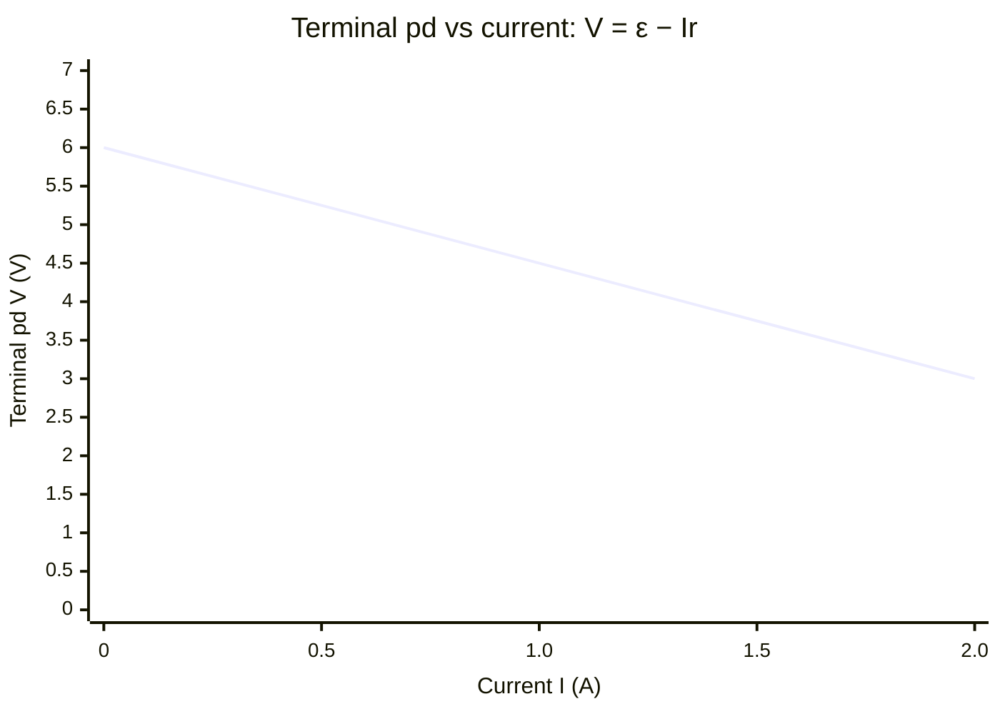

# Find Internal Resistance from a Graph

## Problem Signal

A cell or battery is connected to a varying external load, and a set of terminal-voltage and current readings (or a graph) is given. The question asks for the **emf** and **internal resistance**. Trigger phrases: "plot terminal pd against current", "determine the emf and internal resistance", "the gradient of the graph", "a real battery".

## Required Quantities

- [[Electromotive-Force]]
- [[Current]]
- [[Potential-Difference]]

## Required Concepts

- [[Internal-Resistance]]
- Terminal pd vs emf

## Required Laws or Results

- $V = \varepsilon - Ir$ (rearranged as a straight line $y = c + mx$)

## Required Methods

- [[Finding-Gradient-from-a-Graph]]

## Standard Approach

1. Recognise the model: $V = \varepsilon - Ir$, where $V$ is terminal pd and $I$ is current.
2. Plot $V$ (y-axis) against $I$ (x-axis); expect a straight line with negative gradient.
3. The y-intercept (at $I = 0$) gives the emf $\varepsilon$.
4. The magnitude of the gradient gives the internal resistance $r$.
5. Use a large triangle on the best-fit line for an accurate gradient.
6. State both results with units and a sensible number of significant figures.

## Variations

- Power-against-resistance analysis (maximum power transfer when $R = r$).
- Given two $(V, I)$ data pairs instead of a graph: solve simultaneous equations.
- Lost volts $Ir$ asked for at a specific current.

## Common Traps

- [[Mixing-Up-EMF-and-Terminal-PD]]
- Taking the gradient as $+r$ instead of $-r$ (gradient is negative).
- Reading the intercept off the wrong axis.
- Using only two scattered points rather than a best-fit line.

## Visuals

### V–I graph for emf and internal resistance

*Figure: Straight-line graph of terminal pd against current. The y-intercept (at I = 0) gives the emf ε; the magnitude of the (negative) gradient gives the internal resistance r.*
*Source: Authored for this vault (CC0). No external copyright.*

## Example Sources

- Source: Original problem-type pattern; aligned to OCR H556.
- Exercise/Question: OCR alignment: [[OCR-Physics-A-H556-Specification]]
